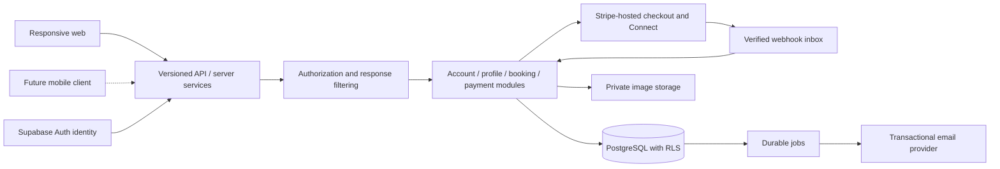
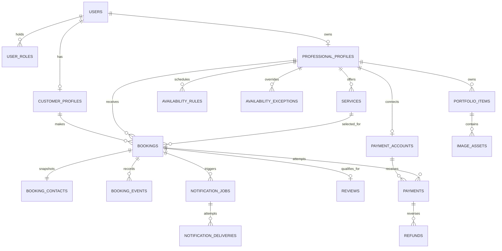

# glohaus — MVP technical architecture

> Implementation update (14 September 2026): see [current status](IMPLEMENTATION-STATUS.md) and [provider setup](SETUP.md) for what is now coded, remaining launch gates, and the expanded discovery-feed/marketplace scope. This architecture describes the target design; it is not a claim of production readiness.

**Status:** proposal for review, 14 September 2026. This document designs the complete MVP; it does not mean these features have been implemented.

The existing code contains the Next.js account foundation, Supabase Auth integration, account/role migration, protected workspace shells, public discovery, profiles, booking, reviews, notification inboxes and protected financial foundations. Provider configuration and live end-to-end validation remain release gates.

## Scope and assumptions

Build a responsive web application for **Customer**, **Beauty Professional**, and **Admin**. A professional owns one independent business profile and serves one customer at a time. Customers may book with many professionals. A person may hold both customer and professional roles without merging their private data.

Proposed MVP limits: one service per appointment; one business location and timezone per professional; England at launch, using GBP (amounts stored in pence) and Europe/London for local scheduling; deposit rules set by each professional; Stripe-hosted deposit checkout; remaining balance handled outside glohaus; transactional email only. These are design defaults, not settled commercial policies. England/GBP and professional-controlled deposit rules are confirmed. Customer cancellation rules below are confirmed as product intent. Confirm whether deposit inputs are fixed amounts or percentages and the payment commercial model before payment implementation. No mobile app, teams, multi-location business, subscriptions, AI marketing, SMS, or calendar synchronisation in this build.

### Confirmed launch and customer cancellation decisions

- Launch market: **England**. Currency: **GBP**, stored in integer pence. Local scheduling uses **Europe/London**, including daylight-saving changes.
- Each professional sets their deposit rules. The amount/formula and refund terms must be visible before checkout and snapshotted on the booking; later edits cannot retrospectively change an existing agreement.
- **At least 24 hours before the appointment:** full deposit refund. Exactly 24 hours belongs to this band; compare server-recorded cancellation time against the booked UTC start instant.
- **Less than 24 hours before the appointment, with accepted reasonable cause:** the professional manually decides the refundable percentage of the captured deposit case by case, based on the customer's situation. There is no preset late-cancellation percentage; a full refund can be chosen. Refunds are not guaranteed merely because a reason was submitted.
- **Less than 24 hours before the appointment without accepted reasonable cause:** proposed contractual outcome is no refund, subject to the consumer-rights safeguard below.
- **No cancellation/no-show without a valid reason:** same proposed no-refund outcome and safeguard. An accepted exceptional explanation receives manual professional review; do not infer completion or review eligibility from elapsed time.
- Cancellation and refund review are separate: a valid cancellation releases the booking according to its lifecycle even while the refund decision is pending. Record pending/approved/declined review separately from the provider's refund processing status. Do not display “refunded” until Stripe confirms success.
- Proposed `cancellation_decisions` records reference the booking and its snapshotted policy; store request time, restricted customer explanation/reason code, pending/approved/declined state, professional decision-maker, concise rationale, selected refund percentage, calculated amount in pence, decision time, and audit reference. Link any resulting `refunds` row to its decision. Allow admin review of disputes; never let a professional decide another professional's booking.
- Apply the percentage to the captured deposit, not the full service price. Calculate with integer arithmetic, round to the nearest penny consistently, and subtract prior successful/pending refund allocations so cumulative refunds cannot exceed the captured deposit. Record both the chosen percentage and authorized monetary amount. A reason accepted as eligible should receive a positive refund percentage; zero is an explicit decline requiring a rationale. No automatic AI judgement and no medical-document uploads in this MVP.
- Sensitive explanations are accessible only to the involved customer/professional and authorized admin. Keep them out of public profiles, reviews, emails and analytics. Present clear terms before checkout and preserve the policy version on every booking.
- Professional settings remain subject to applicable consumer rights. CMA guidance says cancellation retention should generally reflect directly resulting losses; a blanket forfeiture unrelated to losses may be unfair. Legal review of the final consumer terms is a launch requirement, not an assumption that all deposits are non-refundable. [CMA cancellation guidance](https://www.gov.uk/government/publications/cancelling-goods-or-services-guide-for-consumers/cancelling-goods-or-services)

## 1. Recommended frontend architecture

Use the existing **Next.js App Router, React, and TypeScript**. Render public discovery and profiles on the server. Use client components only for interactive controls such as service selection, availability, forms, and portfolio uploads. Keep reusable design tokens, form fields, cards, status displays, navigation, and empty/error states. Adopt CSS Modules for new feature styles as the current global stylesheet grows.

Public pages: `/`, `/discover`, `/professionals/[slug]`. Customer journey: `/book/[professionalId]`, `/bookings/[bookingId]/confirmation`, `/account`, `/account/bookings`, `/account/bookings/[id]`. Professional pages: `/professional`, `/professional/profile`, `/professional/services`, `/professional/portfolio`, `/professional/availability`, `/professional/bookings`, `/professional/bookings/[id]`, `/professional/deposits`, `/professional/reviews`. Shared account pages: `/sign-in`, `/sign-up`, `/onboarding`, `/security`. Admin pages live under `/admin`.

Sensitive pages are dynamic, return `private, no-store`, and load only authorized response objects. Do not serialize complete database rows into client components. Never cache private data using only a URL or a record ID. Public caches contain only published fields and are invalidated when publication or suspension changes. Preview environments remain unindexed; enable indexing only for approved public production pages.

Forms preserve input after errors, show clear confirmation states, support keyboard use and 200% text enlargement, and work at mobile widths. The selected time is always labelled with its timezone. “Deposit paid” must never appear as “appointment paid in full.” Browser storage is limited to harmless UI preferences.

## 2. Backend architecture

Use a **modular monolith**: one repository and deployment, with independently organized business modules. Next.js route handlers are the HTTP boundary; domain services own rules and transactions. Server-rendered pages may call the same services directly, avoiding a request back to the application's own API.



Use the Node.js runtime and a managed PostgreSQL pool in the same region. No microservices, Redis, search cluster, or event-broker infrastructure initially. PostgreSQL supplies transactional persistence, indexed discovery queries, and durable work records. Object storage and email/payment providers are adapters behind server-only modules.

Do not hold database transactions open while contacting Stripe, email, or storage. Commit a pending operation, make the external call with a stable idempotency key, then persist the result. Reconciliation handles uncertain outcomes. External side effects cannot be made atomic merely by placing an API call inside a database transaction.

## 3. Database schema and relationships

Use UUID primary keys, `timestamptz` timestamps, explicit foreign keys, and checked states. Financial values use integer minor units plus ISO currency. Business records normally have `created_at`, `updated_at`, and a version for conflict detection. Never cascade-delete historical appointments or money records when a user or service is removed.

| Entity                         | Principal fields and ownership                                                                                   | Relationships and constraints                                                                                |
| ------------------------------ | ---------------------------------------------------------------------------------------------------------------- | ------------------------------------------------------------------------------------------------------------ |
| `users`                        | `id`, unique `auth_id`, private email/name, `status`, timestamps                                                 | One identity per Supabase Auth subject; active/suspended/removed. Existing.                                          |
| `user_roles`                   | `user_id`, `role`                                                                                                | Composite primary key; customer/professional/admin. Existing.                                                |
| `customer_profiles`            | `user_id`, optional private contact preferences                                                                  | One-to-one with user. Existing skeleton.                                                                     |
| `professional_profiles`        | `id`, unique `user_id`, unique slug, business name, bio, locality, timezone, publication status                  | One owner; draft/published/hidden. Existing skeleton; public fields proposed.                                |
| `professional_private_details` | `professional_id`, booking address, private business contact                                                     | One-to-one; no public reads. Exact address disclosure is configurable, with default after confirmed booking. |
| `services`                     | `id`, `professional_id`, name, description, duration, buffers, price, deposit, currency, active flag, version    | Many per professional; unique `(id, professional_id)` for composite booking references.                      |
| `availability_rules`           | `id`, `professional_id`, weekday, local start/end, effective dates                                               | Multiple intervals permit breaks; timezone comes from the profile.                                           |
| `availability_exceptions`      | `id`, `professional_id`, local date, unavailable/override type, optional start/end                               | Full-day closure or replacement hours; explicit precedence over recurring rules.                             |
| `bookings`                     | Customer, professional, service, time/price/policy snapshots, lifecycle fields                                   | Many per customer and professional; detailed in section 6.                                                   |
| `booking_contacts`             | `booking_id`, customer name, verified email, optional telephone, address snapshot                                | One per booking; private to customer and that professional, plus authorized support access.                  |
| `booking_events`               | `id`, `booking_id`, actor, from/to state, timestamp, reason code, version                                        | Append-only lifecycle history; sensitive support comments are not returned to customers.                     |
| `payment_accounts`             | `id`, unique `professional_id`, provider, connected-account ID, readiness flags, last sync                       | One current connection per professional; account identifiers never accepted from a customer.                 |
| `payments`                     | `id`, `booking_id`, `payment_account_id`, attempt, purpose, amount/currency, provider IDs, status                | Many attempts per booking; one successful deposit obligation; details in section 7.                          |
| `refunds`                      | `id`, `payment_id`, optional `cancellation_decision_id`, amount, reason, request key, provider refund ID, status | Many partial/full refunds per payment; total cannot exceed refundable capture.                               |
| `cancellation_decisions`       | `id`, `booking_id`, policy version, reason, decision-maker, state, percentage, amount, timestamps                | Manual exceptional-cancellation decisions; restricted rationale and audited revisions.                       |
| `provider_events`              | Provider, account scope, event ID/type, object ID, processing state, attempts                                    | Unique `(provider, account_scope, event_id)`; durable webhook inbox.                                         |
| `reviews`                      | `id`, unique `booking_id`, rating, text, moderation status, submitted timestamp                                  | Zero or one per completed booking; reviewer and professional derived from booking.                           |
| `portfolio_items`              | `id`, `professional_id`, caption, display order, publication status                                              | Many per professional; business content separate from stored bytes.                                          |
| `image_assets`                 | `id`, `portfolio_item_id`, storage key, variant, MIME, bytes, dimensions, processing status                      | Original and normalized variants; unique object keys and variant per portfolio item.                         |
| `notification_jobs`            | Event, recipient, booking reference, template/version, due time, state, attempts, lease, deduplication key       | Durable transactional outbox and schedule; detailed in section 10.                                           |
| `notification_deliveries`      | `id`, `job_id`, provider message ID, attempt, timestamps, safe error code                                        | Delivery, bounce, retry history; private operations data.                                                    |
| `admin_audit_logs`             | Actor, action, target, reason, request ID, timestamp                                                             | Existing user-targeted table; add typed targets for bookings/reviews without losing referential integrity.   |
| `idempotency_requests`         | Actor, operation, unique request key, input hash, result reference, expiry                                       | Protect booking/payment mutations from retry duplication; never stores sensitive full HTTP responses.        |

`notification_jobs` is also the notification outbox: do not build a second equivalent queue. Payment inbox events and outbound notification jobs have different purposes and remain separate.



Index foreign keys and actual list patterns: professional/start time, customer/start time, professional/status/start time, published locality/category, visible review/booking, pending notification/due time, unprocessed provider event. Use stable cursor pagination. Start with PostgreSQL text/category/locality search; geography/radius search needs a later product decision. Profile deletion unpublishes; service deletion archives; past booking snapshots remain intact.

## 4. Authentication and authorisation structure

**Supabase Auth authenticates identity. GLOHAUS authorizes actions.** Use Supabase Auth-managed registration, verified email, login, recovery, and MFA. Store its immutable subject as `users.auth_id`; email is never an ownership key. Never trust a role, user ID, professional ID, or price simply because the browser submitted it.

Every private request performs: verified session → active provider identity → database account status → required role → record ownership/relationship → allowed fields/action. Current account code verifies Supabase Auth claims server-side; keep it fail-closed, monitor provider latency/rate limits, and avoid cross-request permission caches. A future short-lived session cache would require a documented revocation strategy before adoption.

Two independent layers protect records:

1. **Service authorization:** explicit policies in domain services, applied to pages, APIs, exports, image access, and background actions. A professional can see a customer's booking contact only through a booking with that professional, never the customer's global profile or other bookings.
2. **Database RLS and column privileges:** enable and force row-level security. Use a non-owner runtime login without superuser/BYPASSRLS. Set the verified identity using transaction-local settings on the same pooled connection and reset by ending the transaction. Default deny when context is absent. The current runtime rejects owner/bypass connections. [PostgreSQL row security](https://www.postgresql.org/docs/current/ddl-rowsecurity.html)

RLS limits accidental broad queries; it is not protection against a fully compromised application server that can supply its own identity context. Continue parameterized SQL, strict inputs, least-privilege roles, dependency updates, and secrets isolation.

For public reads, use **explicit public projection views** containing only approved profile, service, portfolio, and review fields. Their owner is a dedicated non-owner reader with narrow column privileges and applicable RLS, not the migration owner. Grant API public-reader access only to these views. Profile visibility must also reflect the owner's active status through a narrowly scoped helper; do not expose the users table. Test view execution privileges explicitly. Never solve public discovery by disabling RLS or returning the full professional record.

Cross-tenant resources return a uniform `404`; unauthenticated APIs return `401`; permitted identities attempting forbidden actions receive `403`; private responses are not cacheable. Lists, counts, autocomplete, and pagination enforce the same scope as detail endpoints. UUIDs do not replace authorization.

Use origin checks for cookie-authenticated mutations, CSRF-safe methods, bounded JSON bodies, rate limiting, and trusted redirect destinations. Webhooks are authenticated by provider signatures, not browser sessions. Future mobile requests use a separately validated bearer-token flow; do not relax browser origin checks globally. No customer-facing demo login or role-switch bypass.

## 5. User roles and access matrix

| Resource/action                                  | Customer                              | Beauty Professional                                 | Admin                                                       |
| ------------------------------------------------ | ------------------------------------- | --------------------------------------------------- | ----------------------------------------------------------- |
| Published profiles, services, portfolio, reviews | Public access                         | Public access                                       | Public access                                               |
| Personal account/security                        | Own identity                          | Own identity                                        | Own identity                                                |
| Professional editing and uploads                 | No                                    | Owned professional only                             | Explicit moderation action; no silent impersonation         |
| Booking create/read/cancel                       | Own bookings; published policies      | Read/manage bookings assigned to owned professional | Support operations with reason and audit                    |
| Customer contact                                 | Own booking contact                   | Only contact needed for own bookings                | Scoped support access, audited                              |
| Deposit/refund overview                          | Own booking payment summary           | Own professional's deposits                         | Operational payment status; no card data                    |
| Review submission                                | Own completed booking, once           | Only as a customer; not own business                | No fabricated customer reviews                              |
| Review moderation                                | No                                    | Cannot hide/edit customer reviews                   | Hide/restore with reason and audit                          |
| Account suspension/removal                       | No                                    | No                                                  | Explicit workflow, recent MFA, audited                      |
| Role grants                                      | Customer/professional enrollment only | Same                                                | Provisioning through restricted operator workflow initially |

No public admin registration. Existing `admin:grant` requires a separate operator connection and logs grants; it is not an HTTP endpoint. Admin web access requires the database admin role and second-factor verification within 15 minutes. An admin role does not automatically grant professional ownership.

## 6. Booking data model and lifecycle

| Booking field                                                                                | Meaning                                                                                                                                 |
| -------------------------------------------------------------------------------------------- | --------------------------------------------------------------------------------------------------------------------------------------- |
| `id`, `customer_user_id`, `professional_id`, `service_id`                                    | Stable identities; customer comes from session. Composite FK `(service_id, professional_id)` prevents mixing service and provider.      |
| `starts_at`, `ends_at`                                                                       | Absolute appointment instants in UTC, end strictly after start.                                                                         |
| `professional_timezone`, `local_date_snapshot`, `local_start_time_snapshot`                  | IANA zone and original wall-clock intent, not contradictory independently editable fields.                                              |
| `service_name_snapshot`, `duration_minutes`, `buffer_before_minutes`, `buffer_after_minutes` | Agreed service duration and occupied time. Duration must match end-start.                                                               |
| `price_minor`, `deposit_required_minor`, `currency`                                          | Server-priced immutable agreement; `0 <= deposit <= price`. Currency support/minimum charge validated against provider before checkout. |
| `remaining_balance_minor`                                                                    | Derived contractual balance after the required deposit: price minus deposit; not a mutable independent total.                           |
| `policy_snapshot`, `policy_version`, `policy_accepted_at`                                    | Exact cancellation deadline, refund rules, terms displayed and accepted. Structured validated fields plus versioned text.               |
| `status`, `version`                                                                          | State machine and optimistic concurrency version.                                                                                       |
| `hold_expires_at`, `checkout_generation`                                                     | Provisional slot expiry and checkout attempt coordination.                                                                              |
| `cancelled_at`, `cancelled_by_user_id`, `cancellation_reason_code`                           | Cancellation actor/time; system cancellations carry a system actor type.                                                                |
| `completed_at`, `completed_by_user_id`                                                       | Explicit professional/admin completion after appointment end.                                                                           |
| `created_at`, `updated_at`                                                                   | Lifecycle timestamps.                                                                                                                   |

Customer details live in `booking_contacts`, not the public booking representation. Do not collect health/medical consultation information in this MVP. Contact and address snapshots preserve what was agreed, subject to retention rules.

**Proposed states:** `awaiting_deposit → confirmed → completed`; `awaiting_deposit → expired/cancelled`; `confirmed → cancelled`. Failed payment attempts do not erase the booking; retry is permitted while its reservation is valid. No direct client-controlled status patches. No `paid` booking state: attendance and money are independent.

Availability = recurring hours, date overrides, service duration/buffers, lead time/booking horizon, and existing occupied intervals. Use the professional's timezone for local rules. Reject nonexistent spring-forward times; distinguish repeated autumn times by offset. A future timezone change affects new availability, not existing booked instants.

**Prevent double booking at the database boundary.** Use `tstzrange(occupied_start, occupied_end, '[)')` and a GiST exclusion constraint on `(professional_id WITH =, occupied_range WITH &&)` for occupying statuses. This allows adjacent appointments but rejects true overlap, including buffers. The selected PostgreSQL provider must support `btree_gist`. Include completed historical appointments in integrity protection. [PostgreSQL range constraints](https://www.postgresql.org/docs/current/rangetypes.html)

Do not put `now()` into the exclusion predicate: expiry is a state transition, not an automatically changing index condition. A cleanup job resolves expired holds. Booking commands and availability edits lock the same professional row before validating/updating schedules, so time-off changes cannot race a reservation into an unavailable period. Existing confirmed appointments are never silently cancelled by editing working hours.

**Checkout coordination:** propose a 30-minute hold aligned to Stripe Checkout expiry, with a short initialization allowance. Stripe permits configured expiry from 30 minutes to 24 hours. A shorter UX needs explicit expiration calls rather than an unsupported timestamp. [Checkout expiration](https://docs.stripe.com/api/checkout/sessions/create)

Before releasing a potentially payable hold, reconcile or expire its Checkout Session. If provider status is uncertain, retain the slot briefly and retry instead of offering it to another customer. If a late successful deposit reaches an already cancelled/expired or unavailable booking, do not revive or double-book it: record the payment, initiate an idempotent refund, and notify the customer. Delayed payment methods remain disabled initially.

Completion is a professional action after `ends_at`, not a timer assuming attendance. It unlocks review eligibility and triggers a review request. Cancelled/expired bookings are ineligible. Rescheduling is deferred; MVP uses cancellation and a new booking, with clear deposit consequences.

## 7. Payment and deposit data model

Use **Stripe Connect plus Stripe-hosted Checkout**. Propose direct charges on each professional's connected account, subject to launch-country, account configuration, fee/liability, and seller-of-record decisions. Direct-charge payment objects belong to the connected account and must be retrieved in that scope. Stripe collects cards and handles payment authentication; glohaus stores no PAN, CVC, magnetic-stripe data, banking credentials, or identity-verification documents. [Stripe direct charges](https://docs.stripe.com/connect/direct-charges?platform=web&ui=stripe-hosted)

`payment_accounts` stores the provider account reference and `charges_enabled`, `payouts_enabled`, onboarding/readiness status, and last sync time. Gate accepting deposits on verified capabilities, not simply the presence of an account ID. Keep each payment's account reference immutable when professionals disconnect/reconnect, so refunds address the original account.

`payments` stores booking/account FKs, `purpose = deposit`, attempt number, requested/captured amount, currency, Checkout Session ID, PaymentIntent ID, charge ID when available, timestamps, safe failure category, and status (`created`, `pending`, `succeeded`, `failed`, `cancelled`). Uniqueness uses provider + connected-account scope + object ID. One payable attempt at a time per booking; retire a prior session before issuing another. Never overwrite an attempt to make history look successful.

`refunds` records each requested/succeeded/failed refund separately. Reserve pending refund amounts under lock so concurrent partial refunds cannot exceed captured funds. Provider refund calls use stable idempotency keys and retry uncertain results using the same key. Refunds and disputes do not rewrite original captures or mark an appointment incomplete. Provider remains the source of truth for money movement; local records are reconciled projections, not a home-built payment processor.

**Payment flow:**

1. Authenticate the customer; load active owned service/provider configuration; compute price and deposit server-side.
2. Validate and reserve the slot in a transaction; record a payment attempt with a unique request key.
3. Create Checkout outside the transaction using that key and the stored connected account. Persist its ID; recover the same attempt after network failure.
4. Verify webhook signature against the raw request body. Persist the event inbox record before acknowledging it; if persistence fails, return failure so the provider can retry.
5. Process idempotently: verify account scope, object/booking linkage, test/live mode, amount, currency, and successful payment state. Lock the booking, apply its permitted transition, and create notification jobs in one transaction.
6. The confirmation page reads authorized server state and may briefly show “Checking your deposit.” It never confirms from URL parameters or browser redirects alone.
7. Reconcile stale attempts/refunds and out-of-order events against current provider objects. Detect unexpected duplicate successful payments, refund excess, and flag operations.

Stripe can deliver duplicate or out-of-order events; signature verification, deduplication, and recovery are required. Do not put full webhook payloads, card metadata, or secrets into logs. Keep minimum event references and retrieve details when needed. [Stripe webhook guidance](https://docs.stripe.com/webhooks)

**Money presentation:** For an illustrative price of 8000 minor units and deposit of 2000, the contractual remainder is 6000. Before capture show “2000 deposit required”; after capture show “2000 deposit paid; 6000 due at appointment.” Offline balance collection is untracked in the MVP, so do not claim it was collected or call service value earnings. After cancellation display deposit retained/refunded/refund pending under the snapshotted policy, not a resurrected service balance. Refunds on active appointments or goodwill price changes require an adjustment policy before support; do not improvise recalculations.

Deposit reporting separates captured deposits, refunded amounts, pending funds, fees, and provider-reported payouts. A deposit is not a payout. Subscription billing, tips, split payments, platform commission, and storing cards for later use are excluded.

## 8. Review data model

`reviews`: UUID, unique booking FK, integer rating checked 1–5, bounded plain text, `submitted_at`, moderation status (`published`, `hidden`), and optional edit timestamp only if editing is later approved. Reviewer and professional are derived from the booking, preventing mismatched copied identifiers.

In one transaction, require active customer identity, ownership of the booking, `completed` status, appointment end in the past, no prior review, and a professional owner different from the reviewer. Professionals cannot write reviews for their own business or remove negative reviews. Compute eligibility from booking state and existing review; do not store a second mutable eligibility flag.

Public response includes a consented display name/initial, rating, text, and coarse review date; exclude customer UUID, contact, private booking IDs, appointment time, and payment details. Aggregate only published reviews. Moderation hide/restore writes an audit event and updates public counts/cache. A hidden review does not reopen the unique review slot. No fabricated seed reviews in production.

## 9. Portfolio and image storage structure

Recommend private **S3-compatible object storage, initially Cloudflare R2**, behind a storage adapter. Store only metadata in PostgreSQL. Keep development and production buckets distinct. This choice does not move the application hosting away from Vercel.

Logical keys: `professionals/{professional_uuid}/portfolio/{item_uuid}/{asset_uuid}-{variant}`. Use generated IDs, not emails or original filenames, and never trust a browser-supplied object key. Prefixes are organization aids, not authorization.

Upload flow: verify active professional ownership → create pending portfolio/asset records → issue short-lived upload permission for that exact key and size → receive upload → validate actual bytes, dimensions and decoded pixel count → normalize JPEG/PNG/WebP, strip EXIF/GPS and re-encode → mark ready → explicit publication. Reject SVG/HTML and mismatched MIME types; do not auto-publish raw originals.

Use a bounded worker for image processing, with size/pixel limits and cleanup of abandoned uploads. Before public publishing, verify the professional's right to display the client's image. Drafts/originals remain private. Serve published variants through an endpoint that checks current publication and suspension before minting short-lived URLs; if CDN caching is enabled, define and test takedown invalidation/maximum exposure. Revoking access cannot retract copies someone already downloaded. Do not make the entire bucket public to simplify a gallery.

## 10. Notification structure

Email provider recommendation: Resend, accessed only by the server; verify its sending domain before launch. No SMS, push, marketing campaigns, or user-facing notification centre in this MVP.

| Event                              | Recipient                                                   | Trigger                                                  |
| ---------------------------------- | ----------------------------------------------------------- | -------------------------------------------------------- |
| Booking confirmation               | Customer and professional                                   | Booking becomes confirmed after verified payment         |
| Cancellation                       | Customer and professional                                   | Committed cancellation; disclose refund state separately |
| Appointment reminder               | Customer; professional if enabled                           | Proposed 24 hours before confirmed appointment           |
| Review request                     | Customer                                                    | Proposed 2 hours after explicitly recorded completion    |
| Refund outcome / payment attention | Affected customer; professional/admin when action is needed | Verified financial outcome or reconciliation failure     |

`notification_jobs` fields: ID, event type, recipient user ID, booking ID, template/version, `scheduled_at`, deduplication key, state (`pending`, `leased`, `sent`, `cancelled`, `failed`), attempts, `locked_until`, provider idempotency key, and safe error code. Restrict any address snapshot and payload; prefer references and render minimal data at send time. Transactional notices are not permission for future marketing.

Create immediate/delayed jobs in the same transaction as the state change. A scheduler claims due jobs using leases and `FOR UPDATE SKIP LOCKED`, sends outside the transaction, and records delivery attempts. Retry with bounded exponential backoff, provider idempotency, and a terminal failure queue visible to operations. External delivery is at-least-once; do not promise perfect exactly-once email after ambiguous provider responses.

Before sending, recheck booking state/version, recipient authorization, existing review, and cancellation; cancel stale reminder/review jobs. If the booking was made inside the reminder window, skip the already-past reminder rather than send it alongside confirmation. Completion must actually occur before creating review requests.

Recommend a one-minute scheduler sweep and bounded batches when notifications are implemented. Vercel Hobby's once-daily cron limit is unsuitable; use an appropriate plan or approved external scheduler. This is a future operating dependency, not a subscription purchased by this work. [Vercel cron limits](https://vercel.com/docs/cron-jobs/usage-and-pricing)

## 11. Admin structure

Separate `/admin` layouts and `/api/v1/admin/*` controllers, sharing audited domain services. Initial tools: users/professionals, booking overview, review moderation, basic aggregate analytics, and account suspension/removal. No customer impersonation or general-purpose SQL UI.

The normal runtime role cannot freely read all tenants or grant admin. Add narrow administrative database functions/roles when implementing admin operations. Each function validates active database admin membership from the trusted request identity, while the service additionally requires recent MFA. Functions use a fixed search path, minimal privileges, no unsafe dynamic SQL, no public EXECUTE, and append-only audits. Background payment/notification workers use separate least-privilege credentials limited to their responsibilities, not the migration owner.

Suspension revokes access and public visibility, blocks new bookings and uploads, and invalidates public caches. It does **not** silently delete appointments or deposits. Existing bookings need an explicit admin resolution process with customer notifications and policy-appropriate refunds. Money reconciliation continues for suspended accounts. Account removal is a staged anonymization/retention process after open obligations are resolved; no cascading destruction of financial history.

Analytics are restricted aggregates with defined meanings: active customers/professionals, booking count by state/date, gross captured deposits, refunds, and net retained deposits. Exclude test accounts and unpaid holds from completed business metrics. Explain that full service revenue is unknown while balances are collected offline.

## 12. API and service structure

```text
src/app/                         pages, layouts, thin /api/v1 route handlers
src/components/                  reusable UI
src/modules/accounts/            identity-linked accounts and role rules
src/modules/professionals/        public/private profile policies
src/modules/services/            menu, pricing and validation
src/modules/availability/        local schedules and slot calculation
src/modules/bookings/            reservations, state transitions, cancellation
src/modules/payments/            checkout, refunds, reconciliation
src/modules/reviews/             eligibility and moderation
src/modules/portfolio/           ownership, uploads, publication
src/modules/notifications/       outbox, scheduling and delivery
src/modules/admin/               authorized operations and audits
src/lib/                         validated config, SQL, errors and provider adapters
db/migrations/                   immutable versioned migrations
tests/                           business, RLS, integration and browser tests
```

Only accounts and shared helpers currently exist. Add modules as features are implemented; avoid empty abstraction scaffolding.

| API family                                                     | Proposed operations / boundary                                            |
| -------------------------------------------------------------- | ------------------------------------------------------------------------- |
| `/api/v1/me`, `/accounts/enrol`                                | Existing self account read and safe role enrollment                       |
| `/api/v1/professionals`, `/professionals/[slug]`               | Public filtered discovery/profile response                                |
| `/api/v1/professionals/[id]/availability`                      | Public slot times only; never busy customer details                       |
| `/api/v1/professional/profile`, `/services`, `/availability`   | Owner identity derives professional scope                                 |
| `/api/v1/professional/portfolio/uploads`, `/portfolio/[id]`    | Authorized upload intent, finalize, publish/remove                        |
| `/api/v1/bookings`                                             | Create reservation; list only caller's authorized records                 |
| `/api/v1/bookings/[id]`, `/cancel`, `/complete`                | Detail and explicit state-transition commands; actor-specific permissions |
| `/api/v1/bookings/[id]/checkout`, `/payment`                   | Checkout command and authorized deposit status                            |
| `/api/v1/bookings/[id]/review`                                 | Eligible customer submits one review                                      |
| `/api/v1/professional/deposits`, `/payment-account/onboarding` | Owner reports and provider onboarding link                                |
| `/api/v1/admin/*`                                              | Explicit admin commands, recent MFA, audit                                |
| `/api/v1/webhooks/stripe`, `/webhooks/email`                   | Raw-body provider signatures and replay handling                          |
| `/api/v1/internal/jobs`                                        | Scheduler/service authentication; no public or customer access            |

Specify OpenAPI contracts as routes are added, with bounded inputs, safe response schemas, cursor pagination, a request ID, and consistent error codes. Creation/checkout/refund commands require an `Idempotency-Key`, scoped to verified actor and operation. Same key plus changed payload returns conflict. Do not expose database exception text. Avoid generic `PATCH booking.status` or unrestricted “update any fields” endpoints.

## 13. Required environment variables

| Variable                                                                                             | Scope and purpose                                               | When needed                   |
| ---------------------------------------------------------------------------------------------------- | --------------------------------------------------------------- | ----------------------------- |
| `NEXT_PUBLIC_APP_URL`                                                                                | Public canonical origin, redirect and origin validation         | Existing foundation           |
| `NEXT_PUBLIC_SUPABASE_URL`                                                                           | Supabase project URL used by browser and SSR clients                    | Existing foundation           |
| `NEXT_PUBLIC_SUPABASE_PUBLISHABLE_KEY`                                                               | Public Supabase Auth application key                                    | Existing foundation           |
| `NEXT_PUBLIC_SUPABASE_ANON_KEY`                                                                      | Optional compatibility name for the public key                          | Conditional                   |
| `DATABASE_URL`                                                                                       | Server-only non-owner runtime connection, TLS/pooling           | Existing foundation           |
| `MIGRATION_DATABASE_URL`                                                                             | Privileged operator/migration connection; **never web runtime** | Migrations/admin bootstrap    |
| `PAYMENT_WORKER_DATABASE_URL`, `NOTIFICATION_WORKER_DATABASE_URL`                                    | Scoped job credentials; isolated worker runtime/config          | Payment/automation milestones |
| `STRIPE_SECRET_KEY`, `STRIPE_CONNECT_WEBHOOK_SECRET`                                                 | Server-only API and connected-account webhook signature secrets | Payment milestone             |
| `STRIPE_PLATFORM_WEBHOOK_SECRET`                                                                     | Only if a separate platform event endpoint is introduced        | Conditional                   |
| `R2_ENDPOINT`, `R2_ACCESS_KEY_ID`, `R2_SECRET_ACCESS_KEY`, `R2_BUCKET_NAME`                          | Server-only scoped object-storage settings                      | Portfolio milestone           |
| `RESEND_API_KEY`, `RESEND_WEBHOOK_SECRET`, `EMAIL_FROM`                                              | Server email credentials/signature secret and verified sender   | Automation milestone          |
| `CRON_SECRET`                                                                                        | Authenticates scheduled job invocations                         | Automation milestone          |

Hosted Checkout redirects do not require a browser Stripe SDK or publishable key. Add one only if the integration changes to embedded checkout. No OpenAI/AI API keys or subscription price IDs are required for the MVP.

Launch currency, timezone, cancellation policies, reminder offsets, and deposit rules are validated business configuration/profile fields, not secrets. Public env values are bundled at build time: rebuild when they change. Keep placeholders in `.env.example`; actual values go in ignored `.env.local` or provider secret settings. Validate required capabilities at startup/CI and fail closed when absent. Use independent Supabase Auth, database, payment, storage, and email resources for test/staging/production.

## 14. Testing strategy

Run relevant tests after each feature; fix failures before advancing. Current local suite: 164 passing business, route-workflow, HTTP-boundary and PGlite/PostgreSQL policy tests. Browser tests and CI configuration are written but were not previously run end-to-end. Real Supabase Auth/provider/hosted database integration is not yet verified.

| Layer             | Required tests                                                                                                                                                                                         |
| ----------------- | ------------------------------------------------------------------------------------------------------------------------------------------------------------------------------------------------------ |
| Business rules    | State transitions, deposit/remaining amounts, date boundaries, buffer arithmetic, cancellation policy, completion and review eligibility                                                               |
| Database          | Actual migrations, RLS SELECT/INSERT/UPDATE/DELETE, column privileges, protected public views, constraints, rollback, role grants                                                                      |
| Concurrency       | Two independent PostgreSQL connections race for one slot; only one succeeds. Race cancellation/payment, duplicate checkout, refund requests, completion/review. PGlite alone is insufficient for this. |
| API boundaries    | Missing/expired/revoked sessions, forged identities and roles, foreign IDs, origin/body limits, pagination leaks, idempotency payload conflicts                                                        |
| Payment contracts | Stripe test-mode success/decline/authentication, duplicate/out-of-order signed events, invalid signatures, wrong account/mode/currency/amount, lost responses, expiration and late success             |
| Storage           | Cross-tenant upload/read/delete, malicious bytes, oversized pixels, EXIF removal, unsigned originals, expired URLs, suspended/unpublished image access                                                 |
| Notifications     | Transaction rollback produces no job; duplicate work, lease expiry, bounce, retry exhaustion, cancelled reminders, existing reviews, send ambiguity                                                    |
| Browser           | Customer and professional enrollment/login/logout/recovery, admin MFA, complete booking/deposit/confirmation/history, professional editing/cancellation, keyboard and mobile flows                     |
| Deployment        | Production build, secret checks, correct runtime role, migration checksums, TLS, provider callbacks, backups and a restore drill                                                                       |

Use two customers, two professionals, an admin, and suspended/removed identities in the authorization matrix. Intentionally substitute every foreign resource ID in APIs and upload requests. Check empty results, error timing/content, CSV exports if ever added, image variants, and aggregate counts. Assert business outcomes, not merely implementation details. Provider mocks test deterministic failures; dedicated test accounts prove the external integration. Never add a production auth bypass to make browser tests pass.

## 15. Deployment strategy

**Target:** Vercel for Next.js; managed PostgreSQL (Neon is a suitable candidate if its selected plan supports required roles/extensions); Supabase Auth identity; Stripe Connect; private R2 storage; Resend email. Final regions and plan choices require launch-country and operating-budget decisions. No services are provisioned by this document.

Development runs locally. Staging uses isolated non-production services and Stripe test mode, is access-protected, and cannot send real appointment emails. Production uses its own domain, credentials, migration history, webhook endpoints, and customer records. Only a narrow signed-webhook path may be reachable through staging protection for provider testing; never remove protection globally for convenience.

Deployment order:

1. Provision providers and a dedicated database; choose matching regions and retention/backups. Verify `btree_gist`, least-privilege roles, TLS and connection pooling.
2. Apply migrations once using the operator connection with checksum checks and an advisory deployment lock. Never run migrations from browser requests or independently in every server instance.
3. Create non-owner runtime/job roles and supply only their allowed credentials. Keep the migration connection off Vercel runtime.
4. Configure Supabase Auth origin/redirects, email verification, admin MFA, and separate staging/production identities.
5. Run lint, TypeScript, domain/RLS/integration/browser tests and production build in CI; review migration SQL.
6. Deploy staging; test the complete external identity → database flow before claiming working accounts. Add storage/payments/notifications only at their milestones.
7. Configure provider callbacks, signing secrets and scheduling; confirm signed events and reconciliation. Validate actual notification scheduling capability on the selected hosting plan.
8. Perform release review, backup/restore verification and a production smoke test. Publish public discovery only when onboarding and booking operations are ready.

Use additive “expand then contract” migrations compatible with the preceding app version. Application rollback does not undo database changes or provider transactions. Prefer a forward fix; never rewrite an applied migration. Monitor sanitized error rates, database latency, payment inbox age, refund failures, overdue jobs, and denied access spikes. Attach request/event IDs without exposing personal data or secrets.

## Decisions that are expensive to get wrong

| Risk                                               | Consequence                                                 | Decision before implementation                                                    |
| -------------------------------------------------- | ----------------------------------------------------------- | --------------------------------------------------------------------------------- |
| Ownership tied to email or client-supplied IDs     | Account takeover or cross-professional exposure             | Stable subjects/UUIDs, server scope, RLS and compound relationships               |
| Public and private fields returned together        | Contact/address/payment leakage through profiles and caches | Explicit public projections, private booking-contact records, response allowlists |
| One mutable service price used for old bookings    | Changed bills and refund disputes                           | Immutable booking price/duration/policy snapshots                                 |
| Separate “date” and “time” without timezone        | DST errors, wrong reminders, double bookings                | UTC instants plus IANA zone and validated local intent                            |
| Application-only availability check                | Concurrent customers reserve the same time                  | Database exclusion constraint and consistent schedule locking                     |
| Expired UI timer releases a still-payable slot     | Customer charged without an available appointment           | Reconcile/expire checkout before release; refund late success                     |
| One payment row overwritten per booking            | Lost failures, duplicate charges, impossible reconciliation | Immutable attempts, connected-account scope, event inbox and idempotency          |
| Choosing charge model after checkout is built      | Wrong fee/refund/dispute responsibilities                   | Confirm seller, country, connected-account setup and liability first              |
| Calling service price “earnings”                   | Misleading professional reporting                           | Separate service value, deposits, refunds, fees and payouts                       |
| Auto-completing on a clock                         | No-shows receive review requests                            | Explicit completion after end; decide no-show policy before extending states      |
| Public originals or long-lived image links         | Private client photos remain exposed                        | Private storage, validated derivatives, publication checks and takedown plan      |
| Email directly inside a booking request            | Lost/duplicate confirmations after crashes                  | Transactional notification outbox, leases and provider idempotency                |
| Admin uses an unrestricted database owner          | One endpoint bypasses every tenant boundary                 | Narrow operations, recent MFA and append-only audits                              |
| Account deletion cascades to financial records     | Missing evidence and unresolved refunds                     | Suspend/unpublish first; preserve obligations, then defined anonymization         |
| Free daily scheduling assumed sufficient           | Reminders arrive hours late or not at all                   | Confirm scheduler precision and cost before automation release                    |
| Full provider mocks mistaken for integration proof | Locally passing tests but broken real sign-in/payment       | Staging account/provider tests with no auth bypass                                |

**Still to confirm:** professional cancellation handling, refund-review response deadline and dispute process, exact address disclosure, deposit input format (fixed amount/percentage), booking lead time/horizon, image-consent wording, retention periods, and provider operating budget. These do not block reviewing this design; they block finalizing affected booking/payment policies.

## Proposed implementation sequence

1. Finish and externally verify the existing account foundation, setup instructions, and CI.
2. Professional profile/services/portfolio and public discovery.
3. Availability, constrained reservations, cancellation, and booking views.
4. Stripe Connect deposits, refunds, reconciliation, and confirmation.
5. Completed-booking reviews, transactional notifications, and scoped admin operations.
6. End-to-end release verification, backups, accessibility, and production deployment.

The implementation now covers substantial parts of milestones 1–5. Milestones 1–3 are not declared live-complete: external identity/storage setup and independent PostgreSQL concurrency verification remain outstanding. See IMPLEMENTATION-STATUS.md for implemented features and SETUP.md for the authoritative current environment variables and provider choices.
